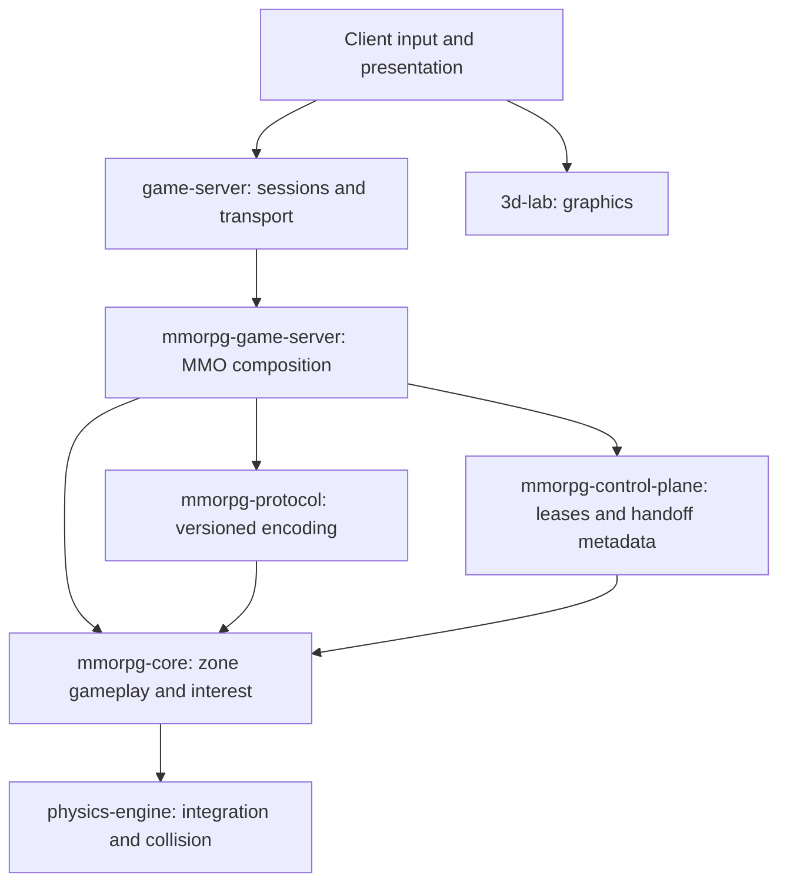

# MMORPG architecture

## Scope and current state

The scaling unit is an authoritative zone. Each zone runs one deterministic physics world on one writer; hosts distribute independent zones. Rendering consumes visible state. Neither a renderer nor a placement service decides gameplay outcomes.

| Capability | Implemented | Remaining production work |
| --- | --- | --- |
| Zone simulation | Fixed ticks, ordered players, capacity, sequenced movement, interest projections | Character abilities, NPCs, combat, inventory, quests |
| Physics | Pinned engine, shared playable outpost, validated static collision content, gravity, velocity-preserving recovery | Authored content pipeline, character controller, workload limits |
| Ownership | Expiring fenced directory; heartbeat-gated host placement; `FencedZoneRuntime` checks every reference-runtime operation | Durable linearizable directory, host-incarnation/local permits, lease-aware network serving |
| Handoff | Idempotent metadata, renewal-safe identity, one active transfer per entity | Frozen state export, staged import, activation/retirement, crash reconciliation |
| Transport | Shared sessions, reconnect, WebTransport, multi-zone host, graceful recovery | Authentication, durable character binding, fleet routing |
| Graphics | Native wgpu client, shared mesh/camera models, live WebTransport snapshots, bounded interpolation; separate offline browser demo | Authored assets, character animation, prediction/reconciliation |
| Persistence | Canonical physical snapshot and shared graceful runtime recovery | Durable checkpoints, character store, fenced persistence writes |

`mmorpg-zone-host` is currently a **standalone host**. It builds ordinary `MatchRuntime`s without acquiring leases. Running two copies with the same zone IDs does not provide distributed authority. `FencedZoneRuntime` is executable reference composition, exercised with two competing owners, not a networked consensus implementation. Production fleet deployment remains gated on the missing ownership and persistence capabilities above.

## Ownership and dependency direction



The control plane imports core domain identifiers, but never holds or mutates a `ZoneSimulation`. `game-server` continues to own session sequencing, ticks, reconnect, replay, recovery and transport. MMO composition must not fork these implementations. Foundations remain pinned to exact revisions.

## Authority and time

An authority grant is `(zone_id, host_id, epoch)`. Its expiry is renewable metadata, not identity. Renewal cannot change the meaning of a handoff ticket. Reassignment always advances the epoch; failed deadline/epoch validation leaves directory state untouched.

Two clocks have different purposes:

- simulation ticks advance deterministic gameplay;
- control-plane time advances lease validity even when a simulation stalls.

The reference caller supplies monotonic control-plane time. Host registrations use that same independent time domain: registration and heartbeat produce bounded liveness windows, and assignment/reassignment require the destination host to be live at the placement instant. Heartbeat expiry is deliberately not a second revocation mechanism; an already-issued zone lease remains authoritative until its own deadline or reassignment fences it. `FencedZoneRuntime::execute` checks control-plane time and the current directory grant before admission, commands, ticks, reconnect, or publication. An immutable directory borrow spans the synchronous operation, so reassignment cannot interleave with it in this in-process model. Regressing time fails closed. The callback is trusted composition code and must not extract the runtime or defer authoritative effects past the checked operation.

A production adapter must not query a distributed database in the simulation hot loop. It needs locally cached, bounded authority permits whose deadlines are conservatively derived from the granting service and a monotonic clock. Failure to renew stops admission, simulation and publication. Revocation cannot depend on a message reaching a partitioned old host.

The control-plane crate now exposes an `EpochFloorStore` compare-and-advance boundary plus `EpochPersistedZoneDirectory`. A new lease epoch is reserved in that store before the in-memory lease becomes visible; persistence failure and concurrent allocators therefore fail closed without acknowledging duplicate authority. Reloading the floor after restart prevents epoch reuse, and a crash after reservation but before local commit can only skip an epoch.

This is deliberately narrower than a production durable directory. Linearizable storage must still persist active ownership and deadlines as well as fencing history before restart-driven failover is allowed. Restoring an epoch floor does not prove that an earlier live lease has expired. A new writer must wait for the old permit to expire, receive an acknowledged retirement, or use an equivalent fencing mechanism. Every durable checkpoint, character write and handoff effect must independently reject stale epochs. Merely rejecting stale control-plane requests does not stop an isolated host from simulating or serving clients.

## Zone gameplay and physical content

`ZoneDefinition` is immutable validated content: a revision, gravity and ordered static colliders. Static IDs occupy a disjoint namespace from player body IDs. Counts, duplicate IDs, non-positive extents and overflowing bounds fail during construction. Content revisions identify immutable published content; reusing a revision for changed collision geometry is forbidden by the content-publishing contract.

`ZoneSimulation::with_definition` and `ZoneGameServerAdapter::with_definition` install that content into the pinned physics engine. Movement commands express intent. Core sets horizontal controller velocity while preserving vertical velocity; the engine integrates gravity and resolves contact. Core does not clamp positions or implement a second collision solver. The low-level default constructor retains the empty zero-gravity test world. Hosted matches now load `outpost_definition()`, also consumed by the native client. The browser demo remains a separate prototype scene.

Coordinates are integer simulation units, 100 units per render metre, Y up. A physics step is one of 30 simulation ticks per second. Velocity is measured in units per tick; gravity is in units per tick squared. Presentation converts units only at its edge. Render meshes, materials, lights and animation have no authority over collision shapes.

Gameplay additions belong in core as typed intent commands with server-owned preconditions and outcomes. An ability should validate its actor, target, range/visibility, cooldown and resource cost against the authoritative tick. Health, cooldowns, AI state and deterministic random state must enter canonical recovery before those features ship. Session-local `PlayerId` must not become an account, character or cross-zone entity identifier. Durable character IDs and their authorization mapping remain a prerequisite to live handoffs.

Interest uses a zone-owned XZ spatial index followed by the exact inclusive distance rule. Nine neighboring cells supply candidates; ordered IDs keep publication deterministic. Admission/removal update the index immediately, and successful physics ticks and recovery rebuild it from authoritative positions. The index is derived state and never enters canonical snapshots. This is a relevance policy, not line-of-sight or stealth authorization. Future visibility rules must remain server-owned. See [deterministic workload evidence](INTEREST_WORKLOADS.md) for query work, snapshot bytes, parity checks and dense-zone limitations.

## Snapshots and compatibility

Canonical and player-visible snapshots have separate scope tags:

- canonical snapshots contain the full definition, every player's position and velocity, movement intent, last sequence and spawn slot;
- player-visible snapshots contain only relevant players' positions and velocities, the content revision and the receiving player's acknowledged command sequence.

Recovering while airborne must reproduce subsequent contact and movement exactly. Restoring only positions and zeroing velocity is insufficient. Immutable content is embedded in the canonical format so restoring does not silently substitute a newer scene. A future content-addressed checkpoint may replace embedded content only if exact availability and integrity are guaranteed.

Snapshot wire and core schema are **version 2**. Command wire version remains 1. Old snapshots are rejected explicitly; no automatic v1 recovery migration is provided. Replay/recovery hashes change with this schema. Existing recovery bundles require an intentional compatibility/migration decision before an upgrade.

The big-endian visible format is documented in [PROTOCOL.md](PROTOCOL.md). Rust and browser tests read the same golden fixture. Decoders reject wrong scope/version, excessive counts, truncation and trailing bytes. Canonical decoding also validates collision content. Canonical state must never be sent to browser clients.

## Native client and graphics

`mmorpg-client` is a native Rust executable using winit 0.30.12 and wgpu 30.0.1. Its GPU adapter consumes pinned `three-d-core` geometry and `three-d-camera` matrices from 3d-lab revision `4f06559812cad1825aaba7be9e2a4860fa072e71`. Server crates do not depend on the desktop/GPU stack.

Tauri is reserved for a future launcher/account/settings shell. The immediate game loop needs a native GPU surface, input and session ownership; adding a webview does not supply these capabilities. See [the native client decision](adr/0001-native-client.md) and [run instructions](NATIVE_CLIENT.md).

The client validates the shared `game-server` session envelope and MMO snapshot protocol, zone ID, content revision and local player presence. TLS uses the system trust store or an explicitly pinned development certificate. No certificate-verification bypass is provided. Movement intents are resent at 20 Hz, with monotonic command sequences; focus loss sends a stopped state. The server alone decides positions and collision results.

A bounded watch channel carries the latest network state to the window; a 32-snapshot presentation history interpolates in server ticks. A classified transport interruption or lack of advancing snapshots triggers one bounded resume attempt; terminal protocol/content failures stop the session. The window owns shutdown of its network worker, including cancellation during resume. Closing the client stops its task and connection. Resize/minimize handling avoids zero-sized GPU surfaces. The first renderer uses lit instanced boxes and a depth buffer, drawing static colliders and player dimensions from the same Rust definitions used by the server.

The native client supports fresh anonymous sessions and in-process resume through the pinned shared reconnect route. Tokens remain private in memory and are replaced only by the server's welcome. A resumed welcome must preserve the player and advance the connection epoch with a new token. The client retains its highest sent command sequence, sends a stopped intent, and waits for its acknowledgement in a valid world snapshot before resuming current input. Every published client update carries the connection epoch so watch-channel coalescing cannot suppress the interpolation reset. Failed or cancelled attempts consume the local resume permission, preventing retries with potentially rotated credentials. No fallback creates a new player.

The reconnect attempt is bounded by the smaller of ten seconds and the advertised grace duration. A 250 ms settle delay allows the old close to reach the server; this is best effort because the pinned protocol has no disconnect acknowledgement. Only timeouts/local transport loss qualify automatically; server application rejection and protocol errors are terminal. This does not promise recovery from server restarts, account persistence, or expired sessions. Authentication, live routing/handoff and shared-physics prediction remain separate work. The browser demo is not wired to native sessions.

## Browser presentation

The presentation path is:

```text
snapshot bytes → strict decoder → ordered bounded history → interpolation → renderer
input intent  → command encoder / session transport → authoritative zone
```

`web/src/replication.ts` owns visible protocol decoding and a 32-snapshot history. It retains 64-bit ticks as `bigint`, rejects duplicate/out-of-order samples, interpolates between known ticks, and holds the latest position during packet loss. New/despawned entities change at sample ticks. Long gaps discard obsolete interpolation history. Zone or content changes require a reset; a transport adapter must also reset on reconnect or authority-epoch changes before delivering a new stream.

The existing demo now feeds this history from a fixed-tick offline source. Camera and avatar rendering consume interpolated positions. Its local movement and waystone interaction remain a prototype, not authoritative online gameplay. Online integration should replace the source and send input to the server, rather than copy those demo rules into a second online authority.

For an online client, buffer delay comes from observed server ticks and jitter; never compare remote ticks directly with wall-clock timestamps. Optional local prediction must reuse compatible physics and content, retain a bounded command history, and reconcile against `acknowledged_sequence`. Remote entities can interpolate. Inventing collision corrections in TypeScript would create competing physics semantics.

Authored assets need an immutable manifest connecting render assets and server collision content to the same revision, with coordinate/scale compatibility checks. Asset streaming, LOD, animation and effects stay client-owned. Missing or incompatible content should stop entry into the zone rather than silently render a different physical world.

## Handoff transaction

A transfer ID is independent of connection and session identity. The metadata registry permits one unfinished transfer per entity and binds its source and destination grants by authority identity. Renewal is safe; stale epochs and transfer-ID collisions fail closed. Committing a transfer releases the entity's reservation, and retrying an old commit cannot release a newer reservation.

The live protocol still needs to implement this ordering:

1. Validate both grants and reserve a unique transfer for the durable entity.
2. Freeze the source entity at a tick boundary; export complete transferable state, including physics and gameplay continuation.
3. Stage the payload at the destination idempotently and reserve capacity. A staged entity must not tick or accept gameplay commands.
4. Record destination acceptance durably.
5. Retire the frozen source only after acceptance; record retirement/commit evidence.
6. Activate the destination exactly once and issue the new session route.

Acceptance and activation are distinct. Allowing the destination to tick immediately while the source still ticks duplicates authority. Retries must bind transfer ID to payload identity as well as both epochs. Recovery must reconcile staged/frozen state with durable transfer status before either entity resumes.

The current registry stores metadata only: `Accepted` does not prove a payload was durably imported and `Committed` does not itself retire an entity. Orphaned transfers intentionally retain their reservation. Automatic expiry or unilateral rollback could duplicate a player; an explicit fenced cancellation/reconciliation protocol is required before live use. Terminal records also need a durable retention/deduplication policy before an unbounded production workload.

## Persistence and operations

Keep the zone hot loop independent of durable I/O. Send bounded checkpoint and durable-command work to an explicit persistence adapter with deadlines and backpressure. Store the zone epoch with every write and condition writes on current authority. Character/inventory/economy transactions belong at durable command/query interfaces; event sourcing remains optional.

The existing `game-server` recovery bundle protects graceful restarts of the exact hosted zone set. It does not provide crash-durable storage, identity authentication or lease authority. Recovery must acquire fresh authority before resuming or publishing.

Status endpoints are operational projections only. Fleet readiness must eventually include a valid permit, compatible content, recovered state and admission capacity. Drain should stop admission first, settle handoffs and persistence, then relinquish authority. A health check must not grant ownership.

Bound players, physics work, pending commands, snapshot bytes and handoff queues independently. The 512-player bound is not a measured capacity claim. Measure deterministic named workloads (sparse travel, dense hub, collision-heavy encounter, reconnect burst, handoff retry storm) before changing limits or adding spatial partitioning. A crowded encounter remains one authoritative physics island unless gameplay explicitly permits an instance/zone split.

## Deployment acceptance gates

Before enabling a distributed fleet, prove with failure injection:

- old-host isolation, lease expiry and reassignment cannot produce accepted stale writes or snapshots;
- pauses and restart cannot extend authority by resetting local time;
- crash at every handoff phase neither duplicates nor loses the durable character;
- checkpoint/content mismatch fails closed and recovery continuation remains deterministic;
- unauthenticated sessions cannot select another account's character;
- overload and drain preserve authority while bounding queues and work.

The current tests prove reference fencing, handoff metadata safety, real engine collision and physical continuation, wire compatibility, client interpolation, and two native clients sharing authority over real loopback WebTransport. The explicit native smoke harness checks GPU readback and optionally a real window. The existing transport still sends whole snapshots as datagrams: dense projections that exceed the negotiated packet budget fail closed. Bounded chunking/replication must be solved in `game-server` before claiming crowded-zone networking capacity. These checks do not claim those production deployment gates are complete.

## Review provenance

This architecture revision was reviewed from repository baseline `3abb86fbd50179487f51ab10e3f88ec585b5a53f`. The live shared conventions resolved to sourceRevision `e6acb5310afaf15c0cba24f87108f5f4ad1bedc3`; this records review provenance, not a consumer policy pin. Validation used Rust 1.98.0 and Bun 1.4.2 with committed dependency locks. The workspace format, Clippy, test and build gates passed, as did client contract tests, type checking, production build and a Chromium movement smoke check.
