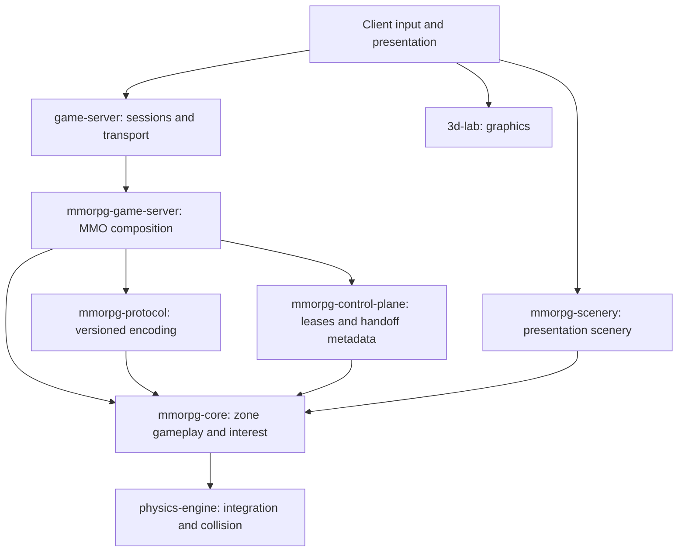

# MMORPG architecture

## Scope and current state

The scaling unit is an authoritative zone. Each zone runs one deterministic physics world on one writer; hosts distribute independent zones. Rendering consumes visible state. Neither a renderer nor a placement service decides gameplay outcomes.

| Capability | Implemented | Remaining production work |
| --- | --- | --- |
| Zone simulation | Fixed ticks in a documented order, ordered players, capacity, sequenced facing-relative movement and grounded jumps; units, targeting, auto-attack, death, corpses, respawn, release spirit, regeneration and tapping; deterministic creature AI (wander, aggro, assist, chase, leash, evade); a zone RNG; bounded per-player events; interest projections | Classes and abilities, progression, loot, inventory, NPC behaviour, quests |
| Physics | Pinned engine, shared Greyhaven Vale content (colliders, spawn plaza, areas, road corridors, creature and NPC bodies), validated static and unit content, gravity, velocity-preserving recovery | Authored content pipeline, character controller, pathfinding around obstacles, workload limits |
| Ownership | Expiring fenced directory; heartbeat-gated host placement; `FencedZoneRuntime` checks every reference-runtime operation | Durable linearizable directory, host-incarnation/local permits, lease-aware network serving |
| Handoff | Idempotent metadata, renewal-safe identity, one active transfer per entity | Frozen state export, staged import, activation/retirement, crash reconciliation |
| Transport | Shared sessions, reconnect, WebTransport, multi-zone host, graceful recovery | Authentication, durable character binding, fleet routing |
| Graphics | Native wgpu client, shared mesh/camera models, live WebTransport snapshots, bounded interpolation; browser demo over a WASM local zone host drawing `mmorpg-scenery`, an asset-tooling archer for Rangers, procedural models for other humanoids, and placeholder creature/NPC bodies; Tab/F/R combat intents and text health/target status in both clients | Target frames, nameplates and combat text (#22 step 7b), other authored avatars, creature models and effects, fog/instancing/lighting control (3d-lab #82, #84), native parity, prediction/reconciliation |
| Persistence | Canonical snapshot of physics, units, creature AI, RNG and events that references its content by revision and fingerprint; shared graceful runtime recovery | Durable checkpoints, content availability for checkpoints, character store, fenced persistence writes |

`mmorpg-zone-host` is currently a **standalone host**. It builds ordinary `MatchRuntime`s without acquiring leases. Running two copies with the same zone IDs does not provide distributed authority. `FencedZoneRuntime` is executable reference composition, exercised with two competing owners, not a networked consensus implementation. Production fleet deployment remains gated on the missing ownership and persistence capabilities above.

## Ownership and dependency direction


```mermaid
flowchart TD
    Client[Client input and presentation] --> Transport[game-server: sessions and transport]
    Transport --> Adapter[mmorpg-game-server: MMO composition]
    Adapter --> Directory[mmorpg-control-plane: leases and handoff metadata]
    Adapter --> Protocol[mmorpg-protocol: versioned encoding]
    Adapter --> Core[mmorpg-core: zone gameplay and interest]
    Protocol --> Core
    Directory --> Core
    Core --> Physics[physics-engine: integration and collision]
    Client --> Renderer[3d-lab: graphics]
    Client --> Scenery[mmorpg-scenery: presentation scenery]
    Scenery --> Core
```

`mmorpg-scenery` is presentation-only: it derives props, road surfaces, water and relief from core content for the native client and, through `mmorpg-wasm`'s scenery export, the browser. It depends on `mmorpg-core`; network hosts never depend on it, and `mmorpg-wasm`'s local zone host never reads it (a test in `mmorpg-wasm/src/scenery.rs` checks the host source). `mmorpg-game-server/tests/dependency_boundary.rs` walks the committed lockfile graph to prove that no host-side crate reaches it, and `cargo tree --locked -p mmorpg-game-server -e normal -i mmorpg-scenery` reports that the package is not in the host's graph.

The control plane imports core domain identifiers, but never holds or mutates a `ZoneSimulation`. `game-server` continues to own session sequencing, ticks, reconnect, replay, recovery and transport. MMO composition must not fork these implementations. Foundations remain pinned to exact revisions.

## Authority and time

An authority grant is `(zone_id, host_id, epoch)`. Its expiry is renewable metadata, not identity. Renewal cannot change the meaning of a handoff ticket. Reassignment always advances the epoch; failed deadline/epoch validation leaves directory state untouched.

Two clocks have different purposes:

- simulation ticks advance deterministic gameplay;
- control-plane time advances lease validity even when a simulation stalls.

The reference caller supplies monotonic control-plane time. Host registrations use that same independent time domain: registration and heartbeat produce bounded liveness windows, and assignment/reassignment require the destination host to be live at the placement instant. Heartbeat expiry is deliberately not a second revocation mechanism; an already-issued zone lease remains authoritative until its own deadline or reassignment fences it. `FencedZoneRuntime::execute` checks control-plane time and the current directory grant before admission, commands, ticks, reconnect, or publication. An immutable directory borrow spans the synchronous operation, so reassignment cannot interleave with it in this in-process model. Regressing time fails closed. The callback is trusted composition code and must not extract the runtime or defer authoritative effects past the checked operation.

A production adapter must not query a distributed database in the simulation hot loop. It needs locally cached, bounded authority permits whose deadlines are conservatively derived from the granting service and a monotonic clock. Failure to renew stops admission, simulation and publication. Revocation cannot depend on a message reaching a partitioned old host.

The control-plane crate now exposes an `EpochFloorStore` compare-and-advance boundary plus `EpochPersistedZoneDirectory`. A new lease epoch is reserved in that store before the in-memory lease becomes visible; persistence failure and concurrent allocators therefore fail closed without acknowledging duplicate authority. Reloading the floor after restart prevents epoch reuse, and a crash after reservation but before local commit can only skip an epoch.

This is deliberately narrower than a production durable directory. Linearizable storage must still persist active ownership and deadlines as well as fencing history before restart-driven failover is allowed. Restoring an epoch floor does not prove that an earlier live lease has expired. A new writer must wait for the old permit to expire, receive an acknowledged retirement, or use an equivalent fencing mechanism. Every durable checkpoint, character write and handoff effect must independently reject stale epochs. Merely rejecting stale control-plane requests does not stop an isolated host from simulating or serving clients.

## Zone gameplay and physical content

`ZoneDefinition` is immutable validated content: a revision, gravity, a spawn grid and ordered static colliders. Static IDs occupy a disjoint namespace from player body IDs. Counts, duplicate IDs, non-positive extents and overflowing bounds fail during construction. Every collider bound and every spawned body must lie within ±32,000 units, and all 512 spawn slots are proven clear of colliders (touching the ground is allowed). `ZoneSimulation` closes that cube with six fixed world-limit bodies whose IDs lie above the player body namespace. They are not content: no player admitted at a spawn slot leaves the cube, whatever the content's walls or gravity, so player projections can carry `i16` positions. Content walls remain the gameplay boundary inside it. Content revisions identify immutable published content; reusing a revision for changed collision geometry is forbidden by the content-publishing contract.

`ZoneContent` is the complete immutable content of one zone: that definition plus its named areas, creature templates, creature spawns, NPCs and graveyard position. `ZoneContent::new` validates the tables once (unique IDs, level and damage bounds that cannot overflow, respawn times of at least the corpse duration, bounded wander radii and half extents) and proves every creature, NPC and graveyard body stands on the ground clear of colliders, other units and player spawn slots. It is shared as `Arc<ZoneContent>`, and its identity is `revision()` plus `fingerprint()`: FNV-1a 64 over a canonical big-endian encoding of every table, colliders included, plus the item catalog, starter grant and declared RNG seed. The RNG seed defaults to the pre-inventory physical/unit content hash; Greyhaven revision 4 explicitly preserves the revision-3 seed so a bag-only change does not reroll creature behavior. `ZoneSimulation::with_content` and `ZoneGameServerAdapter::with_content` start a zone from it; `ZoneSimulation::with_definition` wraps physical-only content without units (`ZoneContent::from_definition`, which the adapter hosts the same way). They install that content into the pinned physics engine. Movement commands express intent. Core sets horizontal controller velocity while preserving vertical velocity; the engine integrates gravity and resolves contact. Core does not clamp positions or implement a second collision solver. The low-level default constructor retains the empty zero-gravity test world. Hosted matches, the browser's WASM local host and the native client load `greyhaven_vale::content()`; `mmorpg-scenery` derives its visuals from the same definition. Named areas (`ZoneAreas`, `greyhaven_vale::areas()`) are core content for the same revision; clients read area names from them and later explore objectives will decide membership with the same table.

Greyhaven Vale (`mmorpg_core::greyhaven_vale`, content revision 4) is the starter zone of [the design contract](STARTER_ZONE.md): a flat 240 m playable square (y = 0) inside 20 m boundary walls. Its static boxes are the Greyhaven Outpost hub (keep, inn, smithy, four houses, well, waystone, graveyard, a palisade with four gates, each a 4.4 m clear opening between 0.8 m posts in a 6 m palisade gap), the generated Wolfrun Woods trunks (a seeded jittered grid that always leaves 1.5 m between trunks), Millbrook Farm (barn, farmhouse, windmill base, field fences), Stillwater Lake's shore rocks (the walkable water itself has no collider) and Redbrand Hollow (cliffs under the northern wall, mine entrance, tents, crates, campfire). Map north is −Z. Content also defines:

- `SPAWN_PLAZA`/`SPAWN_GRID`: 512 slots, 1 m apart, on the hub plaza, which no collider touches;
- `roads()`: centre lines of the road network. They are open corridors: no collider comes within 2 m of a segment, checked with exact integer geometry;
- `areas()`: the five named subzones as a `ZoneAreas` table, ordered by `AreaId` with disjoint bounds, for future exploration objectives and for presentation names;
- `units`: seven creature templates (Timber Wolf, Young Boar, Grain Rat, Field Marauder, Mirefin Lurker, Redbrand Bandit and the elite Garrick Redbrand), 59 spawns in their subzones (IDs grouped by subzone, 60 s respawn, 6 m wander radius, Garrick 5 min), nine friendly NPCs at their posts (Marshal Elden Greywatch, Tanner Hilda Brook, Innkeeper Bram Tolliver, Farmer Osric Mill, Brother Aldous the spirit healer and four gate guards) and the graveyard beside the hub's gravestones. Tests prove every spawn lies inside its subzone, clear of colliders, and every creature's wander area stays farther than the interest radius from the spawn plaza.

Collider IDs are grouped by structure in `greyhaven_vale::ids` so presentation can derive its visuals from the collider table without core knowing about visuals.

## Presentation scenery

`mmorpg-scenery` (`greyhaven_vale_scenery()`) turns that content into a deterministic `Scenery` value for clients:

- **props**: one visual per structure collider, mapped by collider ID (keep, inn, houses, palisade segments, gate posts, trees, rocks, cliffs, tents …), plus seeded decorations (grass tufts, flowers, bushes, reeds, background pines on the mountain slopes, crop rows, lamps, signposts, barrels, carts, a dock) placed by a SplitMix64 stream and rejected against colliders, roads, the plaza and water. Each prop has a kind, feet position on y = 0, `u16` yaw, per-mille scale and optional collider ID. Tests assert the collider mapping is one-to-one and that no prop intersects a collider it does not visualise;
- **roads** (3 m wide over core's centre lines) and **water** (Stillwater Lake as an ellipse with a 0.15 m surface; the water is walkable and has no collider);
- **relief**: `height_at(x, z)` in integer units from seeded integer value noise, at most ±0.6 m inside the playable square, exactly 0 under and near structures, roads, the plaza, the spawn slots and water, rising to 40 m mountains beyond the walls and, beyond the ±200 m terrain grid, to distant ranges of up to 140 m. `terrain_grid(step)` samples heights and biome colours (grass, road dirt, plaza, forest floor, farmland, sand, rock, snow) over ±200 m; `far_terrain_grid(step)` samples the same relief over ±600 m for a coarse far ring. Snow starts at 50 m, so only the distant ranges carry it;
- **prop kinds** have stable names (`PropKind::name`, e.g. `tree-pine`), which clients key their models by.

Relief is presentation-only: walkable ground stays physically flat, and clients draw a unit at its physics position plus `height_at` at its XZ. Walkable slopes would need a heightfield or step-up controller in `physics-engine`. `Scenery::stable_hash` pins the derived output, so every platform renders the same vale.

Inside the bounded Outpost footprint, `height_at` consumes the [saved authored relief field](RELIEF_AUTHORING.md): exact signed-centimetre nodes on a half-metre grid, flattened offline through pinned asset-tooling. Integer bilinear sampling maps it into the same terrain and unit/prop query path for both clients. Surrounding relief and procedural prop placement retain their original function and RNG execution. The producer owns mask editing; scenery owns world-space sampling. Neither the field nor its masks enter gameplay or collision authority.

Movement intent is `Move { forward, strafe, facing }` with each axis in `[-1, 1]` and a `u16` facing (65 536 steps per turn, 0 facing +Z, increasing toward +X). Core rotates the intent into one of eight headings relative to the facing through `trig::direction`, a quarter-wave sine table generated at compile time with integer arithmetic; no floating point decides authoritative state. The character's right is `direction(facing − 90°)`. Run and strafe speed is 21 units/tick (6.3 m/s); any backward component uses 13 units/tick. Facing is stored per player and has no collision effect.

`Jump` records a pending intent. Each tick first evaluates every pending jump against the pre-step world: a probe two units deep under the feet, inset one unit horizontally so side contact with a wall does not count, uses the physics `overlap_query`, and any touching body other than the character itself means grounded. A grounded jump sets vertical velocity to 16 units/tick; physics then applies gravity. The tick consumes every pending jump whether or not it fired, so mid-air jumps are ignored rather than buffered. Setting velocities never moves bodies, so probe results are independent of player iteration order. The character body is 0.6 m × 1.8 m × 0.6 m (`PLAYER_HALF_EXTENTS_UNITS`, shared with clients) and spawns with its feet on y = 0.

Coordinates are integer simulation units, 100 units per render metre, Y up. A physics step is one of 30 simulation ticks per second. Velocity is measured in units per tick; gravity is in units per tick squared. Presentation converts units only at its edge. Render meshes, materials, lights and animation have no authority over collision shapes.

Gameplay additions belong in core as typed intent commands with server-owned preconditions and outcomes. An ability should validate its actor, target, range/visibility, cooldown and resource cost against the authoritative tick. Cooldowns, auras and every later authoritative field must enter canonical recovery before those features ship, as unit health, AI state and the zone RNG already have. Session-local `PlayerId` must not become an account, character or cross-zone entity identifier. Durable character IDs and their authorization mapping remain a prerequisite to live handoffs.

Interest uses a zone-owned XZ spatial index of every visible unit (players, living creatures, corpses and NPCs) followed by the exact inclusive distance rule (45 m). Nine neighboring cells, each one radius wide, supply candidates. A deterministic priority cap then keeps at most `MAX_VISIBLE_ENTITIES` (64) records: the viewer first, its current target next, then ascending `(squared XZ distance, kind, id)`. The protocol packs as many of them as fit one datagram in that order (48 without events); distant relevant units are omitted by priority, never by transport truncation. Admission, removal, despawns, respawns and released spirits update the index immediately, each successful physics tick moves the memberships whose cell changed (a corpse keeps its cell), and recovery rebuilds it from authoritative positions. Creature aggro and assist searches query the same index instead of scanning every player. The index is derived state and never enters canonical snapshots. This is a relevance policy, not line-of-sight or stealth authorization. Future visibility rules must remain server-owned. See [deterministic workload evidence](INTEREST_WORKLOADS.md) for query work, snapshot bytes, parity checks and dense-zone limitations.

## Units, combat and creature AI

A unit is a player, creature or NPC, named by `EntityRef = Player(PlayerId) | Creature(CreatureId) | Npc(NpcId)` and ordered by kind, then ID. Each kind owns a disjoint physics body ID namespace above the static colliders and the world-limit bodies (validated by compile-time assertions and a test). Core modules follow the concepts: `entity`, `rng`, `unit` and `combat`, `creature` and `ai`, `events`, `projection` and `snapshot`.

**Zone RNG.** A SplitMix64 stream seeded from the declared content RNG seed and zone ID. Its state is canonical. Draws happen only at fixed points of the tick order: creature level and first wander delay at (re)spawn, wander delays and destinations, and the hit table.

**Tick order.** `ZoneSimulation::advance_tick` clears last tick's events, then:

1. consumes pending player intents in `(player id, sequence)` order;
2. makes creature AI decisions in creature-ID order, which set creature velocities;
3. sets player movement velocities and grounded jumps (dead players stand still);
4. steps physics once;
5. maintains the interest index from the new positions;
6. resolves combat in `EntityRef` order, players before creatures: swing timers, range checks after movement, damage, threat, deaths and tapping;
7. runs regeneration, corpse despawns and respawns;
8. advances the tick counter.

**Players** are class-agnostic until step 8: level 1, 50 + 15 × (level − 1) maximum health, melee damage 3–6 plus 1 per level above 1, a 60-tick swing and a 250-unit centre-distance reach. Creatures reach 200 units plus the target's half-width and swing on their template's timer. The integer hit table is 5 % miss, 5 % critical (×1.5, rounded down) and otherwise a hit, with damage uniform in the range.

**Intents.** `SelectTarget`, `StartAttack`, `StopAttack` and `ReleaseSpirit` queue in sequence order (at most 16 per player between ticks) and resolve in step 1; `apply_command` only validates and records them. A well-formed intent that is not allowed produces an `Error` event (no target, out of range, target dead, not attackable, you are dead, not dead, invalid target) and never a session error; stale or duplicate sequences fail closed as before. An intent beyond the bound consumes its sequence and is dropped, and the next tick reports `TooManyIntents` once, so a burst of queued key presses after a network stall never closes the session. Selecting requires the unit to exist within the interest radius. Only living creatures are attackable.

**Auto-attack** swings whenever the swing timer is ready and the target is within reach after movement. Out of range it holds the ready swing and reports `OutOfRange` at most once per second. The target's death stops it.

**Death.** A creature at zero health leaves a corpse without a physics body for 30 s, then despawns and respawns at its spawn point with full health and a new level roll after its template's respawn time (counted from death). A player at zero health keeps its body where it fell, leaves every threat table, cannot move and can only `ReleaseSpirit`, which moves it to the graveyard through the physics API with half its maximum health (rounded up).

**Combat state and regeneration.** A unit is in combat while it is on a living creature's threat table or dealt or took a blow in the last 150 ticks, dead or alive. After 180 ticks out of combat a living player regenerates 3 % of its maximum health (rounded up) and again every 30 ticks.

**Tapping.** The first player to damage a creature taps it until it resets (credit for later XP and loot). Projections flag creatures tapped by another player.

**Creature AI** (`ai`), deterministic and in creature-ID order:

- *Idle* creatures wait 5–15 s (RNG), then walk to a random point within their wander radius at 40 % run speed (8 units/tick). Aggressive creatures engage the nearest living player within their aggro radius, 10 m ± 1 m per level of difference, clamped to 5–20 m, found through the interest index. Neutral creatures engage only when attacked.
- *Engaged* creatures fight the threat leader (threat is the damage the player dealt; ties go to the lowest `EntityRef`). They steer straight at it at 19 units/tick through integer normalisation (`trig::xz_length`, `trig::yaw_from_vector`), face it, and stop inside their reach; the last step aims 10 units inside the reach so integer rounding never stalls a chase. Distances saturate and steering offsets beyond the `i32` range are halved, so a recovered player position anywhere in that range cannot overflow AI or combat arithmetic. Physics blocks obstacles; there is no navmesh in this slice. When a creature engages from idle, idle creatures of its family within 8 m engage the same target.
- *Evading* starts when a creature strays beyond 40 m from its spawn point or its threat table empties. It clears threat and tap, runs home at 24 units/tick ignoring attacks (the attacker sees `Evade`), and on arrival resets to full health and idle. A creature still away after 10 s is moved home through the physics API.

**Events.** Each player has a bounded queue of at most 16 events per tick: damage dealt and taken, miss, died, evade and error. On overflow an event replaces the latest queued event of strictly lower priority (died > damage taken > error > damage dealt > miss and evade) or is dropped, so overflow is deterministic. Events produced in tick N stay in zone state until tick N + 1 starts. They are part of the canonical snapshot, so recovery reproduces the projection of tick N exactly, and they appear in the viewer's projection for tick N.

The deterministic evidence is in `mmorpg-core/tests/combat.rs` (scripted hunts, assist, death, release, evade, leash, refused intents, chases from every heading, identical runs), `mmorpg-protocol/tests/combat_recovery.rs` (recovery through canonical bytes mid-chase, mid-swing, after a death, during an evade, around corpses and respawns, each compared tick by tick with the uninterrupted run for 300 ticks, plus byte-identical independent runs), `mmorpg-core/tests/recovery.rs` (content identity, restored creature bounds and extreme player positions) and the `vale-wolf-hunt` bot scenario over the hosted vale ([SCENARIOS.md](SCENARIOS.md)).

## Snapshots and compatibility

Canonical and player-visible snapshots have separate scope tags:

- canonical snapshots contain the content identity (revision and fingerprint), the zone RNG state, every player's position and velocity, facing, forward/strafe intent, pending jump, last sequence, spawn slot, inventory with its revision/change tick, level, XP, health, target, auto-attack, swing/combat/regeneration/error timers, pending intents with the dropped-intent flag and this tick's events, and every creature's level, health, facing, position and velocity, life cycle (alive, corpse or despawned with its death tick), AI state with timers and wander destination, threat table, swing and combat timers and tap;
- player-visible snapshots contain the viewer's own ID, the content revision, the receiving player's acknowledged command sequence, the viewer's exact health, level, XP, flags and target, the target's own target, inventory revision and an optional complete self bag, this tick's events for the viewer, and priority-ordered entities (players, creatures and NPCs) with kind, ID, appearance, compact `i16` position, presentation velocity (saturated to `i8`), facing, level, health percent and flags.

The current MMO projection policy retains `MAX_PLAYER_PROJECTION_BYTES` (1,077), the measured 1,161-byte datagram floor minus the 20-byte session header and a 64-byte margin. The encoder writes sections in fixed priority (header, self, target, optional bag, events) and then packs entities by relevance until that budget is used; the viewer and its target always fit. See [PROTOCOL.md](PROTOCOL.md#datagram-byte-budget). `game-server` fragments session frames larger than the connection's datagram size, and the native client reassembles them. A future projection expansion can revise the MMO budget independently of this transport mechanism.

Recovering while airborne, mid-run, with a pending jump or in the middle of a fight must reproduce the continuation exactly. Restoring only positions and zeroing velocity is insufficient.

**Content-addressed checkpoint rule.** Canonical snapshots reference their content by revision and fingerprint instead of embedding it. `ZoneSimulation::from_snapshot(snapshot, content)` fails closed unless the supplied `ZoneContent` has exactly that identity, so restoring can never silently substitute a newer scene or creature table, and checkpoints no longer carry the collider table. A recovering host must therefore obtain the identical content; hosts that build the zone set from their compiled-in content, as the standalone host and graceful recovery do, satisfy this. Durable checkpoints need a content store that guarantees exact availability of every revision still referenced before content can be published independently of host builds. Changing any content table, colliders included, without a new revision is a publishing error that the fingerprint turns into a refused recovery rather than a divergent continuation.

Snapshot wire and core schema are **version 7**; command wire is **version 2** (tags 3–7 added). Old snapshots are rejected explicitly; no automatic v6 recovery migration is provided. Replay/recovery hashes change with this schema. Existing recovery bundles require an intentional compatibility/migration decision before an upgrade.

The big-endian visible format is documented in [PROTOCOL.md](PROTOCOL.md). Rust and browser tests read the same golden fixtures. Decoders reject wrong scope/version, excessive counts, unknown codes, truncation and trailing bytes. Recovery validates canonical unit state against the content. Canonical state must never be sent to browser clients.

## Native client and graphics

`mmorpg-client` is a native Rust executable using winit 0.30.13 and wgpu 30.0.1. Its GPU adapter consumes pinned `three-d-core` geometry and `three-d-camera` matrices from 3d-lab revision `f484db8a3d2a7a555fa463eddf9c28790b240ce0`. Server crates do not depend on the desktop/GPU stack.

Tauri is reserved for a future launcher/account/settings shell. The immediate game loop needs a native GPU surface, input and session ownership; adding a webview does not supply these capabilities. See [the native client decision](adr/0001-native-client.md) and [run instructions](NATIVE_CLIENT.md).

The client validates the shared `game-server` session envelope and MMO snapshot protocol, zone ID, content revision, viewer ID and local player presence. TLS uses the system trust store or an explicitly pinned development certificate. No certificate-verification bypass is provided. A third-person orbit camera (mouse drag orbits, wheel zooms) supplies the facing: while a movement key is held, the character's facing intent follows the camera yaw. Movement intent is sent on change (facing-only changes at most once per server tick) and resent at 20 Hz, with monotonic command sequences; focus loss sends a stopped state. Jump is sent once per key press and never replayed after resume. The server alone decides positions, jumps and collision results.

A bounded watch channel carries the latest network state to the window; a 32-snapshot presentation history interpolates in server ticks. A classified transport interruption or lack of advancing snapshots triggers one bounded resume attempt; terminal protocol/content failures stop the session. The window owns shutdown of its network worker, including cancellation during resume. Closing the client stops its task and connection. Resize/minimize handling avoids zero-sized GPU surfaces. The renderer has two pipelines sharing one camera binding and a depth buffer: an indexed, vertex-coloured mesh pipeline for the `mmorpg-scenery` terrain grid (2 m vertices over ±200 m) and the lake surface, and lit instanced boxes for prop blockouts (uploaded once) and units (every frame). Every structure's first box is its exact core collider, so what players see matches what blocks them. Units render at their physics position plus the presentation relief under them. The far plane is 600 m against a sky clear colour, without fog. Instances carry a yaw that the vertex shader applies; each unit renders a body rotated by its projected facing plus a small nose marker, and presentation interpolates facing along the shorter arc. Creatures and NPCs are placeholder boxes sized by their collision boxes and coloured by disposition (hostile, neutral, friendly); corpses lie flat. Tab, F and R turn the latest projection into `SelectTarget`, `StartAttack`/`StopAttack` and `ReleaseSpirit` intents, and the window title shows health, combat state and target. Creature and NPC names come from the compiled-in zone content by the projection's appearance ID.

The native client supports fresh anonymous sessions and in-process resume through the pinned shared reconnect route. Tokens remain private in memory and are replaced only by the server's welcome. A resumed welcome must preserve the player and advance the connection epoch with a new token. The client retains its highest sent command sequence, sends a stopped intent, and waits for its acknowledgement in a valid world snapshot before resuming current input. Every published client update carries the connection epoch so watch-channel coalescing cannot suppress the interpolation reset. Failed or cancelled attempts consume the local resume permission, preventing retries with potentially rotated credentials. No fallback creates a new player.

The reconnect attempt is bounded by the smaller of ten seconds and the advertised grace duration. A 250 ms settle delay allows the old close to reach the server; this is best effort because the pinned protocol has no disconnect acknowledgement. Only timeouts/local transport loss qualify automatically; server application rejection and protocol errors are terminal. This does not promise recovery from server restarts, account persistence, or expired sessions. Authentication, live routing/handoff and shared-physics prediction remain separate work. The browser demo is not wired to native sessions.

## Browser presentation

The presentation path is:

```text
snapshot bytes → strict decoder → ordered bounded history → interpolation → renderer
input intent  → command encoder / session transport → authoritative zone
```

`web/src/replication.ts` owns visible protocol decoding and a 32-snapshot history. It retains 64-bit ticks as `bigint`, rejects duplicate/out-of-order samples, interpolates positions and shorter-arc facing between known ticks, and holds the latest pose during packet loss. New/despawned entities change at sample ticks. Long gaps discard obsolete interpolation history. Zone, content or viewer changes require a reset; a transport adapter must also reset on reconnect or authority-epoch changes before delivering a new stream.

The demo feeds this history through a `WorldSource` (`web/src/world/`): `join`, `leave`, `sendCommand`, `advance(dt)`, `latestProjection` and interpolated `sample`. `LocalZoneSource` wraps the `mmorpg-wasm` `LocalZone` ([ADR 0002](adr/0002-browser-embeds-zone-simulation.md)): it encodes command wire v2 with strictly increasing sequences, runs fixed 30 Hz ticks from a bounded accumulator (at most four catch-up ticks per frame), and decodes every tick's encoded player-scoped projection. Presentation never sees canonical state or the simulation itself, so an online WebTransport source (#29) is a drop-in. The browser owns no movement, collision or interaction rules; input becomes intent through an outbox that mirrors the native client's resend rules.

Static scenery comes from the module's versioned `scenery()` export behind a `SceneryProvider`. The export maps `mmorpg-scenery`'s Greyhaven Vale into format `mmorpg.scenery` v3: the terrain grid every 4 m over ±200 m and a far ring of the same relief every 20 m over ±600 m, each with one biome ID per sample; a prop kind table and one compact record per prop (`[kind, x, feetY, z, yaw, scalePermille, halfX, halfY, halfZ]`, feet standing on the relief); every structure's exact core collider box; road centre lines; the lake as water; and the core's named areas. The TypeScript decoder fails closed on unknown kinds and malformed records. Area lookup and relief (`Scenery::height_at`) call back into Rust. The page refuses scenery whose content revision differs from the zone's. Export v3 also carries a hash of its complete presentation data, at the actual exported terrain resolutions, as `presentationFingerprint`, included in browser resource keys independently of gameplay revision. The saved Outpost grass family is compiled from asset-tooling-filtered placements; [the authoring workflow](SCATTER_AUTHORING.md) preserves accepted IDs and excludes detail without modifying core content.

The world presentation (`web/src/world/world-view.ts`) builds the static scene once per content revision and then only moves transforms:

- **Terrain** is one indexed mesh per colour with smooth normals from the height field. A triangle's colour averages its corners' biome tones, so biome edges get a soft band, and grass, forest floor and rock vary between a few tones. Each colour is a scene-wide mesh that is never culled, so rarer colours within a small sRGB distance of a more common one take its colour: the vale's terrain grid and far ring come to about 36 meshes instead of over 100, and a test bounds them. Roads, the plaza, the field and the lake shore are smooth surfaces over the grid instead of grid cells. The far ring blends toward the sky haze by distance band, standing in for fog.
- **Props** get procedural low-poly models per kind (`prop-models.ts`), built in the prop's frame around its body box, so a structure's walls are its collider; roofs, towers and canopies rise above it, and a test keeps walls at body height on their collider. A prop stands on the drawn terrain at its anchor rather than on its exported feet height: the 4 m mesh differs from the full-resolution relief by up to about 0.4 m on woodland relief, where trees and grass would otherwise hover or sink. Static batching (`mesh-batching.ts`) merges parts into one mesh per (spatial chunk, colour, cull class): about 4,200 props and the terrain become about 470 nodes and 195,000 vertices that upload once under stable resource keys. The renderer frustum-culls batches by bounding sphere; grass, flowers and small props are hidden beyond 75–150 m through `visible`. Windmill sails, the campfire flame and reeds are separate animated nodes.
- **Units** render through a model registry keyed by entity kind (`unit-nodes.ts`): players are stylised humanoids (`humanoid.ts`) with class gear, placed by forward kinematics from a pure, bounded pose function (`character-animation.ts`) driven by interpolated velocity, facing and distance travelled. A model reads the whole projected entity and gives its own body half height, which puts its feet on the ground, and the minimap colours a unit's dot from the entity too. Creatures and NPCs use placeholder bodies in the same registry (`units/creature-bodies.ts`): a box of the template's collision size (a character-sized post for NPCs) coloured by disposition and shaded by family, laid flat when dead, with a ring under the viewer's target; their minimap dots take the same disposition.
- **Sky and camera**: the canvas is transparent over a CSS gradient sky that tracks the horizon line, with slowly drifting clouds and a subtle time-of-day drift; reduced motion stops every cosmetic animation. The orbit camera eases its zoom, stays above the rendered ground under it and collides with nothing else; a left drag orbits freely and a right drag turns the character.
- **HUD**: a circular minimap painted from a map image rendered once from scenery, and an F3 overlay with frame rate, node counts and the renderer's work observations. `?debug` adds camera viewpoints and statistics for browser acceptance; they never touch the simulation.

The pinned renderer has no fog, sky, sun, vertex colour, emissive or instancing support yet (3d-lab #84 and #82). `EnvironmentStyle` and the batching module are the seams where those features replace the baked haze bands, per-colour batches and colour-only glows.

Combat input and feedback are small modules under `web/src/world/units/` hooked into the world view. Tab selects the nearest living attackable creature and cycles outward, F or a right click (a right drag still turns) toggles auto-attack and R releases a dead spirit; each is an intent resolved against the latest projection when the next frame sends it. Two HUD text lines show the viewer's health, combat state and target and the latest feedback event. Names come from the module's versioned `catalog()` export (`mmorpg.catalog` v2: creature templates with family, behaviour, levels and body size, NPCs with roles, area names and immutable item names/stack limits), which carries the content revision and fingerprint; the browser refuses to enter a zone whose revision differs from the catalog's. Combat numbers, spawn points and AI never leave Rust. Target frames, nameplates and combat text are step 7b of #22.

For an online client, buffer delay comes from observed server ticks and jitter; never compare remote ticks directly with wall-clock timestamps. Optional local prediction must reuse compatible physics and content, retain a bounded command history, and reconcile against `acknowledged_sequence`. Remote entities can interpolate. Inventing collision corrections in TypeScript would create competing physics semantics.

Authored assets need an immutable manifest connecting render assets and server collision content to the same revision, with coordinate/scale compatibility checks. Asset streaming, LOD, animation and effects stay client-owned. Missing or incompatible content should stop entry into the zone rather than silently render a different physical world.

## Handoff transaction

A transfer ID is independent of connection and session identity. The metadata registry permits one unfinished transfer per entity and binds its source and destination grants by authority identity. Renewal is safe; stale epochs and transfer-ID collisions fail closed. Committing a transfer releases the entity's reservation, and retrying an old commit cannot release a newer reservation.

The live protocol still needs to implement this ordering:

1. Validate both grants and reserve a unique transfer for the durable entity.
2. Freeze the source entity at a tick boundary; export complete transferable state, including physics and gameplay continuation.
3. Stage the payload at the destination idempotently and reserve capacity. A staged entity must not tick or accept gameplay commands.
4. Record destination acceptance durably.
5. Retire the frozen source only after acceptance; record retirement/commit evidence.
6. Activate the destination exactly once and issue the new session route.

Acceptance and activation are distinct. Allowing the destination to tick immediately while the source still ticks duplicates authority. Retries must bind transfer ID to payload identity as well as both epochs. Recovery must reconcile staged/frozen state with durable transfer status before either entity resumes.

The current registry stores metadata only: `Accepted` does not prove a payload was durably imported and `Committed` does not itself retire an entity. Orphaned transfers intentionally retain their reservation. Automatic expiry or unilateral rollback could duplicate a player; an explicit fenced cancellation/reconciliation protocol is required before live use. Terminal records also need a durable retention/deduplication policy before an unbounded production workload.

## Persistence and operations

Keep the zone hot loop independent of durable I/O. Send bounded checkpoint and durable-command work to an explicit persistence adapter with deadlines and backpressure. Store the zone epoch with every write and condition writes on current authority. Character/inventory/economy transactions belong at durable command/query interfaces; event sourcing remains optional.

The existing `game-server` recovery bundle protects graceful restarts of the exact hosted zone set. It does not provide crash-durable storage, identity authentication or lease authority. Recovery must acquire fresh authority before resuming or publishing.

Status endpoints are operational projections only. Fleet readiness must eventually include a valid permit, compatible content, recovered state and admission capacity. Drain should stop admission first, settle handoffs and persistence, then relinquish authority. A health check must not grant ownership.

Bound players, physics work, pending commands, snapshot bytes and handoff queues independently. The 512-player bound is not a measured capacity claim. Measure deterministic named workloads (sparse travel, dense hub, collision-heavy encounter, reconnect burst, handoff retry storm) before changing limits or adding spatial partitioning. A crowded encounter remains one authoritative physics island unless gameplay explicitly permits an instance/zone split.

## Deployment acceptance gates

Before enabling a distributed fleet, prove with failure injection:

- old-host isolation, lease expiry and reassignment cannot produce accepted stale writes or snapshots;
- pauses and restart cannot extend authority by resetting local time;
- crash at every handoff phase neither duplicates nor loses the durable character;
- checkpoint/content mismatch fails closed and recovery continuation remains deterministic;
- unauthenticated sessions cannot select another account's character;
- overload and drain preserve authority while bounding queues and work.

The current tests prove reference fencing, handoff metadata safety, real engine collision and physical continuation, wire compatibility, client interpolation, and two native clients sharing authority over real loopback WebTransport. The explicit native smoke harness checks GPU readback and optionally a real window. The existing transport still sends whole snapshots as datagrams: dense projections that exceed the negotiated packet budget fail closed. Bounded chunking/replication must be solved in `game-server` before claiming crowded-zone networking capacity. These checks do not claim those production deployment gates are complete.

## Review provenance

This architecture revision was reviewed from repository baseline `3abb86fbd50179487f51ab10e3f88ec585b5a53f`. The live shared conventions resolved to sourceRevision `e6acb5310afaf15c0cba24f87108f5f4ad1bedc3`; this records review provenance, not a consumer policy pin. Validation used Rust 1.98.0 and Bun 1.4.2 with committed dependency locks. The workspace format, Clippy, test and build gates passed, as did client contract tests, type checking, production build and a Chromium movement smoke check.

Starter progression is core-owned: death rewards the eligible tapper exactly
once; XP/level are character-durable canonical facts and exact self-projection
state. Leaving clears taps so a reused session-local player ID cannot inherit
an old reward. Shared rules and cap behavior are in PROGRESSION.md.


The browser Bags panel reads only the self sheet. It caches the last received
slots across omitted sheets, disables intent while a higher revision is missing,
and recovers on the periodic full sheet. Its session identity and tick/revision
checks reject stale updates; enter/leave clears selection, slots and feedback.
The panel sends `MoveItem` through `WorldView` and the existing sequenced source,
without simulating moves or grants. A bounded source advance returns each decoded
projection in tick order (at most four local catch-up ticks), so intermediate
sheets and refusals reach the bag cache before drawing the newest frame. Catalog format v2 adds item catalog revision
and ID/name/stack-limit records; v1 exports fail closed at that presentation
boundary. The snapshot/command wire and content identity remain v7/v2/revision 4.
